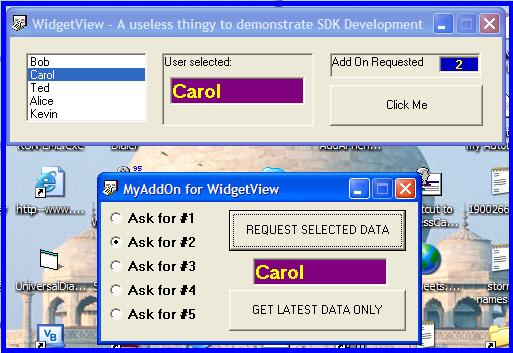



## Your own SDK for your creative off\-the\-shelf apps using clsMemoryMap\!

### Description

With clsMemoryMap (Class Module employing RtlMoveMemory et al) you can SHARE memory between your application and others.

It is therefore, a darned neat way to provide interactive communications between your retail application and Add-Ons that can be developed by 3rd parties for YOUR package!

Of course, this is nothing new (I have no idea who knocked out the original and clever Class Module - tidied up a wee bit by me) but what I am showing you all here, is a simple method to provide a "Software Development Kit" for your cool applications that can be remotely controlled in a fashion similar to DDE.

Sans the issues you may otherwise encounter with DDE, of course.

This submission comprises two very simple VB6 programs.

The FIRST VB6 App is called "WidgetView" a useless thing that has a simple list of 5 names.

WidgetView has a timer called MySDK that examines a SHARED MEMORY (vb6Request) and updates a Label. When the label changes, it invokes a request from the listbox and submits the data back to the AddOn program, just by "poking" the result into a SHARED MEMORY (vb6Result).

The SECOND VB6 App is called "MyAddOn". It does very little. The user picks a number between 1 and 5, and sets the SHARED MEMORY (VB6Request) with that value, and uses a similar timer called MySDK, to examine changes to the Vb6Result memory variable.

It is, as I say, rudimentary, but as you make up your own rules and control them with CASE/SELECT statements, you can build up a pretty groovy SDK for your App in next to no time!

Enjoy,

Kevin Ritch

V8Software.com
 
### More Info
 

             |
---                |---
**Submitted On**   |2007-02-17 21:15:06
**By**             |[Kevin Ritch](https://github.com/Planet-Source-Code/PSCIndex/blob/master/ByAuthor/kevin-ritch.md)
**Level**          |Advanced
**User Rating**    |5.0 (15 globes from 3 users)
**Compatibility**  |VB 5\.0, VB 6\.0
**Category**       |[Coding Standards](https://github.com/Planet-Source-Code/PSCIndex/blob/master/ByCategory/coding-standards__1-43.md)
**World**          |[Visual Basic](https://github.com/Planet-Source-Code/PSCIndex/blob/master/ByWorld/visual-basic.md)
**Archive File**   |[Your\_own\_S2048542182007\.zip](https://github.com/Planet-Source-Code/kevin-ritch-your-own-sdk-for-your-creative-off-the-shelf-apps-using-clsmemorymap__1-67894/archive/master.zip)

